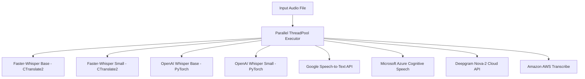

# Class-Wise Domain-Specific Speech-to-Text (STT) Benchmarking System

[](https://www.python.org/)
[](https://streamlit.io/)
[](https://plotly.com/)
[](LICENSE)
[](CONTRIBUTING.md)

---

## 📖 Table of Contents
1. [What is this Project? (In Simple Words)](#-what-is-this-project-in-simple-words)
2. [Why Does This Project Exist? (The Problem It Solves)](#-why-does-this-project-exist-the-problem-it-solves)
3. [Who is This For?](#-who-is-this-for)
4. [Which Domains & Real-World Use Cases?](#-which-domains--real-world-use-cases)
5. [Beginner's Guide to STT / ASR Metrics](#-beginners-guide-to-stt--asr-metrics)
6. [Supported STT Models (Architectures Compared)](#-supported-stt-models-architectures-compared)
7. [The 8-Step Benchmarking Workflow](#-the-8-step-benchmarking-workflow)
8. [Getting Started (Beginner-Friendly Step-by-Step)](#-getting-started-beginner-friendly-step-by-step)
9. [Project Architecture & Directory Structure](#-project-architecture--directory-structure)
10. [Frequently Asked Questions (FAQ) & Troubleshooting](#-frequently-asked-questions-faq--troubleshooting)
11. [License & Acknowledgements](#-license--acknowledgements)

---

## 🌟 What is this Project? (In Simple Words)

When computers convert spoken voice audio into written text, that technology is called **Speech-to-Text (STT)** or **Automatic Speech Recognition (ASR)**. 

Today, there are dozens of competing AI models available—from open-source models like **OpenAI Whisper** and **Faster-Whisper** to cloud services from **Google, Microsoft Azure, Deepgram, and Amazon AWS**.

However, **there is no single "best" model for everything**. A model that transcribes everyday YouTube videos with 99% accuracy might completely fail when transcribing medical prescriptions, courtroom arguments, or rapid sports commentary.

This project is an **Enterprise-Grade Benchmarking Platform** built with Python and Streamlit. It lets you:
1. Group your audio files into **Domain Classes** (e.g., Medical, Sports, Technology).
2. Attach verified human transcripts (**Ground Truth**).
3. Run **8+ STT models in parallel** against the same audio.
4. Calculate standard industry accuracy scores (**WER, CER, BLEU, ROUGE, METEOR**).
5. Automatically receive an **AI-driven summary** explaining *which model is the champion for each domain* and *why*.

---

## ❓ Why Does This Project Exist? (The Problem It Solves)

### 1. The "One-Size-Fits-All" Fallacy
Standard STT benchmark leaderboards test models on generic audiobooks (like LibriSpeech). In production, however, your audio is never a clean audiobook:
- Medical audio contains rare chemical compounds (*"lisinopril"*, *"metformin"*).
- Financial calls contain critical numbers, currencies, and percentages (*"$4.2B in Q3"*).
- Customer calls have heavy background noise, compressed phone audio (8 kHz), and speaker interruptions.

### 2. High Cost of Choosing the Wrong Model
Commercial cloud APIs charge per audio hour. If a company processes 100,000 hours of calls per year, picking AWS over Deepgram or self-hosted Faster-Whisper could mean spending **\$140,000 instead of \$26,000** for identical or worse accuracy.

### 3. Subjective Guesswork vs. Concrete Data
Engineers often select a model based on hype rather than domain-specific metrics. This application replaces subjective intuition with:
- Concrete error rates (WER, CER).
- Semantic retention scores (BLEU, ROUGE-L, METEOR).
- Latency and Real-Time Factor (RTF).
- Cost vs. Accuracy Pareto curves.

---

## 👥 Who is This For?

| Role | How This System Helps |
| :--- | :--- |
| **Enterprise CTOs & Tech Leads** | Identify the most cost-effective and accurate STT model before committing to vendor contracts. |
| **Data Scientists & NLP Engineers** | Benchmark newly fine-tuned models against commercial baselines across custom test sets. |
| **Healthcare & Legal Tech Teams** | Verify if an ASR engine can safely transcribe drug names, dosages, and legal terminology without hallucinations. |
| **Call Center / Contact Center Managers** | Measure which model best handles telephony audio, multiple speakers, and background chatter. |
| **NLP & AI Students / Researchers** | Learn how speech evaluation metrics (WER, CER, Alignment matrices) work under the hood through interactive visuals. |

---

## 🏢 Which Domains & Real-World Use Cases?

The platform is designed around **domain classes**. Here are examples of industries where domain-specific benchmarking is essential:

```
Dataset (All Audio Files)
 ├── 🏥 Healthcare & Medicine (Doctor-Patient Consultations, Prescriptions)
 ├── 💼 Finance & Banking (Earnings Calls, Financial Advising, Tickers)
 ├── ⚖️ Legal & Courtroom (Depositions, Cross-Examinations, Statutory Law)
 ├── 💻 Technology & Software (Programming Lectures, Cloud Architecture Talks)
 ├── ⚽ Sports & Broadcasting (Fast-Paced Commentary, Stadium Noise)
 └── 📞 Customer Support (Call Center Inquiries, Telephony Audio)
```

### Domain Challenges Breakdown

| Domain | Key Acoustic & Linguistic Challenges | Why Generic Models Struggle |
| :--- | :--- | :--- |
| **🏥 Healthcare** | Drug names, anatomical terms, dosages (`50mg vs 15mg`). | A generic model will substitute unfamiliar words (e.g. converting *"lisinopril"* to *"listen April"*), creating dangerous errors. |
| **💼 Finance** | Rapid numbers, currencies, quarters (`Q3 revenue up 14.2%`). | Standard models often spell out numbers phonetically or drop decimal points. |
| **💻 Technology** | Technical acronyms (`CTranslate2`, `Kubernetes`, `PyTorch`). | Off-the-shelf models mistake technical jargon for standard English words. |
| **⚽ Sports** | High crowd noise, screaming commentators, overlapping voices. | Low Signal-to-Noise Ratio (SNR) causes models to drop words (Deletions). |
| **📞 Telephony** | 8 kHz sample rate, cellular compression, accents. | Models trained purely on high-fidelity 16 kHz studio recordings degrade significantly. |

---

## 📐 Beginner's Guide to STT / ASR Metrics

When comparing a model's transcription (**Hypothesis**) against the verified human transcript (**Reference / Ground Truth**), the system calculates several industry-standard metrics. Here is what they mean in plain English:

### 1. Ground Truth (Reference)
The exact, 100% correct transcript typed by a human listener. This serves as the benchmark against which models are judged.

### 2. Word Error Rate (WER)
The primary metric used in speech recognition. It measures how many word-level corrections are needed to turn the model's output into the Ground Truth:

$$\text{WER} = \frac{\text{Substitutions} + \text{Deletions} + \text{Insertions}}{\text{Total Reference Words}} \times 100$$

- **Substitution (S)**: A word was misheard (*"weather"* instead of *"whether"*).
- **Deletion (D)**: A word was skipped or missed completely.
- **Insertion (I)**: The model hallucinated or added an extra word that was never spoken.
- 💡 **Rule**: **Lower is better.** A WER of `0%` means a word-for-word exact match.

### 3. Character Error Rate (CER)
Similar to WER, but evaluated at the individual letter/character level.
- 💡 **Why it matters**: In medical or legal domains, a typo of one letter can change a word's entire meaning. Lower is better.

### 4. BLEU, ROUGE-L & METEOR (Semantic Metrics)
WER can sometimes be overly strict. If the audio says *"Hello world"* and a model writes *"Hi world"*, the WER will penalize it, even though the semantic meaning was preserved.
- **BLEU-1 / BLEU-2**: Measures $n$-gram precision (word overlap) between hypothesis and reference.
- **ROUGE-L**: Measures the Longest Common Subsequence (LCS). Higher indicates sentence structure preservation.
- **METEOR**: Uses stemming and synonym matching (via NLTK WordNet) to reward semantic equivalence.
- 💡 **Rule**: **Higher is better (0% to 100%).**

### 5. Entity Error Rate (EER / Jargon Error)
Focuses exclusively on whether critical keywords (brand names, drug names, legal terms) were transcribed correctly, ignoring common filler words like *"the"*, *"and"*, or *"is"*.

### 6. Acoustic & Performance Metrics
- **SNR (Signal-to-Noise Ratio in dB)**: Measures audio clarity. $>25\text{ dB}$ is studio quality; $<15\text{ dB}$ is noisy.
- **VAD (Voice Activity Detection)**: Ratio of voiced human speech vs. dead silence or pauses.
- **RTF (Real-Time Factor)**: $\frac{\text{Processing Time}}{\text{Audio Duration}}$. An RTF of $0.1\times$ means 10 seconds of audio were transcribed in just 1 second.

---

## 🤖 Supported STT Models (Architectures Compared)

The platform compares **8 industry-leading models** simultaneously:



1. **Faster-Whisper (Base & Small)**: CTranslate2-optimized implementation of OpenAI's Whisper. Up to 4x faster with lower memory usage.
2. **OpenAI Whisper (Base & Small)**: The standard PyTorch implementation of Whisper. Highly robust across accents.
3. **Google Cloud Speech-to-Text**: Google's production cloud API with global language coverage.
4. **Microsoft Azure Speech**: Enterprise ASR engine from Microsoft Cognitive Services.
5. **Deepgram Nova-2**: High-speed, commercial end-to-end deep learning architecture designed for low latency.
6. **Amazon AWS Transcribe**: AWS enterprise speech engine tailored for business telephony.

*(Note: The platform features graceful fallback simulation logic so you can test the dashboard workflow even without live cloud API keys!)*

---

## 🔄 The 8-Step Benchmarking Workflow

The web interface is organized into 8 intuitive tabs matching a complete benchmarking lifecycle:

```
[1. Dataset & Classes] ➔ [2. Audio & Refs Review] ➔ [3. Select & Run] ➔ [4. File Results]
                                                                              │
[8. Executive Report]  ⬅ [7. Final Analysis]     ⬅ [6. Error Diff]    ⬅ [5. Class Comparison]
```

1. **📁 Tab 1: Dataset & Classes**: Create custom domains (e.g., "Technology", "Healthcare"). Upload multiple audio/video files for each class and type or paste their Ground Truth transcripts.
2. **🎧 Tab 2: Audio & Refs Review**: Inspect your dataset with built-in audio players to verify every file has its corresponding reference transcript.
3. **🚀 Tab 3: Select & Run**: Choose which of the 8 models you wish to benchmark and trigger parallel batch execution.
4. **📄 Tab 4: File Results**: Select any specific class and file to inspect the Leaderboard, Champion Podium, and KPI metrics (WER, CER, BLEU, ROUGE, METEOR).
5. **📊 Tab 5: Class-wise Comparison**: View aggregated Plotly bar charts comparing how every model performed across different classes (e.g., comparing Whisper's performance on Sports vs. Legal).
6. **🔍 Tab 6: Error Analysis**: Inspect interactive 2D error heatmaps and color-coded word-by-word diffs:
   - 🟢 **Green**: Correct word match.
   - 🟠 **Orange**: Substitution (Model misheard the word).
   - 🔴 **Red**: Deletion (Word missed in transcript).
   - 🔵 **Blue**: Insertion (Extra word hallucinated by model).
7. **🤖 Tab 7: Final Analysis**: Automatically generates a natural language summary identifying the domain champions, overall winner, and domain-specific trends based on actual calculated data.
8. **📜 Tab 8: Report**: Download a unified, flat CSV scorecard of all file metrics across all domains for presentations or further spreadsheet analysis.

---

## 🚀 Getting Started (Beginner-Friendly Step-by-Step)

Follow these steps to run the benchmark on your local machine:

### 1. Prerequisites
- **Python 3.9 to 3.12** installed on your system ([Download Python](https://www.python.org/downloads/)).
- Git installed ([Download Git](https://git-scm.com/)).

### 2. Clone the Repository
Open your terminal (PowerShell on Windows, or Bash on macOS/Linux) and run:
```bash
git clone https://github.com/your-username/stt-benchmark-system.git
cd stt-benchmark-system
```

### 3. Create and Activate a Virtual Environment
A virtual environment keeps project dependencies isolated and prevents system package conflicts.

**On Windows (PowerShell):**
```powershell
python -m venv venv
.\venv\Scripts\Activate.ps1
```
*(If PowerShell displays an execution policy error, run `Set-ExecutionPolicy -ExecutionPolicy RemoteSigned -Scope CurrentUser` once).*

**On macOS / Linux:**
```bash
python3 -m venv venv
source venv/bin/activate
```

### 4. Install Project Dependencies
Install all necessary packages via `pip`:
```bash
pip install -r requirements.txt
```

If you do not have a `requirements.txt` file yet, install the core dependencies directly:
```bash
pip install streamlit pandas plotly numpy scipy pydub SpeechRecognition openai-whisper nltk rouge-score jiwer
```

### 5. Launch the Application
Run the Streamlit app:
```bash
streamlit run app.py
```

Your web browser should automatically open the dashboard at:
👉 **`http://localhost:8501`**

---

## 📂 Project Architecture & Directory Structure

```text
nlp-ese/
│
├── app.py                     # Primary Streamlit web application & tab workflow
├── evaluator.py               # Levenshtein DP alignment engine (WER, CER, ROUGE, METEOR)
├── transcription_engine.py    # Multi-threaded parallel model execution & audio conversion
├── visualizer.py              # Plotly chart generators, 2D error heatmaps, and HTML diffs
├── audio_analyzer.py          # Signal-to-Noise Ratio (SNR), VAD, and clipping detectors
├── cost_recommender.py        # Cost vs Accuracy Pareto frontier & recommendation logic
├── report_generator.py        # Executive HTML/PDF export engine
├── sample_data/
│   └── samples.py             # Pre-configured domain datasets for instant demo runs
└── README.md                  # Complete project documentation
```

---


